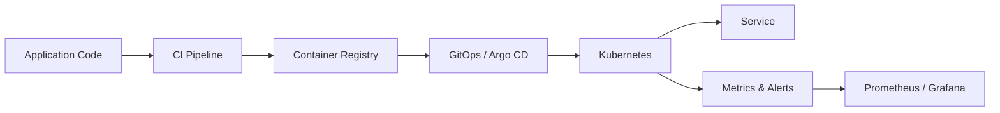

# 이태호 · Taeho Lee

### Cloud Infrastructure · DevOps · Platform · AI Infrastructure

AWS와 Kubernetes를 기반으로 **반복 가능한 배포**, **관측 가능한 운영**과 
그리고 **비용 효율적인 인프라**를 설계하고 구현합니다.

## About me

- 클라우드 인프라에서 애플리케이션이 **안정적으로 배포되고 운영되는 과정 전체**에 관심이 있습니다.
- AWS, Kubernetes, GitOps, 모니터링을 중심으로 플랫폼 엔지니어링 역량을 쌓고 있습니다.
- 백엔드 개발 경험을 바탕으로 Java/Spring 서비스와 인프라 사이의 문제를 함께 살펴봅니다.
- 현재 클라우드 환경의 **리소스 효율적인 Agentic Workflow Orchestration**과 하이브리드 AI 인프라를 탐구하고 있습니다.

## Engineering notes

### [태호의 기술 블로그 →](https://bright-gibbon-ac2.notion.site/39f812e9889981fbb410ce901533246d)

클라우드·AWS·Kubernetes·백엔드 개발 과정에서 배운 내용과 문제 해결 기록을 정리합니다.

## Selected projects

### [Graduation Plant AI Server](https://github.com/xogh3198/graduation_AI)

> AWS 서버리스와 로컬 GPU를 연결한 하이브리드 식물 분석 파이프라인

- S3 이벤트를 Lambda가 라우팅하고, K3s의 FastAPI·YOLO 서버가 GPU 추론을 수행하도록 구성했습니다.
- Tailscale 기반 사설 연결, Docker/K3s 배포 매니페스트, 스모크 테스트를 함께 관리합니다.
- **Stack:** AWS S3, Lambda, K3s, FastAPI, YOLO, Docker, Tailscale

### [MONEY PROJECT](https://github.com/xogh3198/MONEY_PROJECT)

> 금융 커뮤니티와 AI 기반 홍보 콘텐츠 제작 기능을 제공하는 멀티서비스 백엔드

- 인증·포트폴리오, 웹훅, 알림, 뉴스·영상 렌더 서비스를 분리해 운영합니다.
- Docker Compose 기반 실행 환경과 GitHub Actions → EC2 배포 흐름을 구성했습니다.
- **Stack:** Java, Spring Boot, PostgreSQL, Docker Compose, GitHub Actions, AWS EC2

### [CloudWave Kubernetes Platform](https://github.com/xogh3198/cwave_k8s)

> Kubernetes 애플리케이션 배포와 관측 환경을 코드로 관리한 플랫폼 구성

- Argo CD, Helm, NGINX Ingress와 환경별 매니페스트로 GitOps 배포 구조를 구성했습니다.
- Prometheus·Grafana와 Kafka/PostgreSQL exporter를 활용한 모니터링 구성을 다뤘습니다.
- **Stack:** Kubernetes, Argo CD, Helm, Karpenter, Prometheus, Grafana, AWS

## GitHub stats

<picture>
  <source media="(prefers-color-scheme: dark)" srcset="https://github-readme-stats.vercel.app/api?username=xogh3198&amp;show_icons=true&amp;include_all_commits=true&amp;hide_border=true&amp;rank_icon=github&amp;theme=github_dark" />
  <source media="(prefers-color-scheme: light)" srcset="https://github-readme-stats.vercel.app/api?username=xogh3198&amp;show_icons=true&amp;include_all_commits=true&amp;hide_border=true&amp;rank_icon=github&amp;theme=default" />
  
</picture>
<picture>
  <source media="(prefers-color-scheme: dark)" srcset="https://github-readme-stats.vercel.app/api/top-langs/?username=xogh3198&amp;layout=compact&amp;langs_count=6&amp;hide=html,css,smarty&amp;hide_border=true&amp;theme=github_dark" />
  <source media="(prefers-color-scheme: light)" srcset="https://github-readme-stats.vercel.app/api/top-langs/?username=xogh3198&amp;layout=compact&amp;langs_count=6&amp;hide=html,css,smarty&amp;hide_border=true&amp;theme=default" />
  
</picture>

## Platform mindset

좋은 플랫폼은 개발자가 배포 과정 자체보다 제품에 집중하게 하고, 운영자는 상태와 실패 원인을 빠르게 파악할 수 있게 해야 한다고 생각합니다.

## Tech stack

**Cloud & Platform** 

**Observability** 

**Application & Data** 

## Experience & credentials

| Category | Details |
| --- | --- |
| Experience | BiteCompany / TradLab · SureSoftTech |
| Education | Inha University, Computer Engineering |
| Training | CJ OliveNetworks Cloud Wave |
| Certifications | AWS Certified Solutions Architect – Associate · 정보처리기사 · SQLD · 컴퓨터활용능력 · TOEIC Speaking IH |

Build repeatable systems. Observe what matters. Improve continuously.

