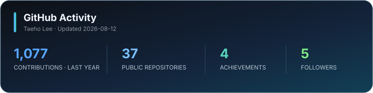

# Taeho Lee · 이태호

### Cloud Infrastructure · DevOps · Platform Engineering

AWS와 Kubernetes를 기반으로 안정적인 배포와 관측 가능한 운영 환경을 만듭니다.

## Focus

- **Platform:** AWS · Kubernetes · GitOps · CI/CD · Observability
- **Application:** Java/Spring · Python/FastAPI · Kafka · PostgreSQL
- **Exploring:** AI Infrastructure · Resource-efficient Agentic Workflows

## Selected work

| Project | What I built | Core stack |
| --- | --- | --- |
| [BiteCompany](https://www.bitecompany.co.kr) | 수산물 판매자와 소비자를 연결하는 B2B2C 커머스 플랫폼 개발·운영 | AWS · Docker · CI/CD |
| [CloudWave K8s](https://github.com/xogh3198/cwave_k8s) | GitOps 배포 및 애플리케이션 관측 환경 | Kubernetes · Argo CD · Helm · Prometheus · Grafana |
| [rhwp](https://github.com/edwardkim/rhwp) | Rust·WASM 기반 HWP/HWPX 편집기의 문서 비교·이력 UI 안내 개선 ([merged PR #1162](https://github.com/edwardkim/rhwp/pull/1162)) | Rust · WebAssembly · Open Source |
| [Plant AI Server](https://github.com/xogh3198/graduation_AI) | AWS 이벤트와 로컬 GPU를 연결한 하이브리드 AI 파이프라인 | S3 · Lambda · K3s · FastAPI · YOLO |
| [MONEY PROJECT](https://github.com/xogh3198/MONEY_PROJECT) | 금융·홍보 기능을 제공하는 멀티서비스 백엔드와 EC2 배포 흐름 | Spring Boot · PostgreSQL · Docker · GitHub Actions |

## Core stack

## Experience

<table>
  <tr>
    <td align="center" width="90">
      
    </td>
    <td><strong>BiteCompany / TradLab</strong></td>
    <td align="center" width="150">
      
    </td>
    <td><strong>SureSoftTech</strong></td>
  </tr>
</table>

**Inha University, Computer Engineering** · **CJ OliveNetworks Cloud Wave**

## Certifications

## GitHub activity

## Writing

📚 [**태호의 기술 블로그 — 클라우드·AWS·Kubernetes 학습과 문제 해결 기록**](https://bright-gibbon-ac2.notion.site/39f812e9889981fbb410ce901533246d)
